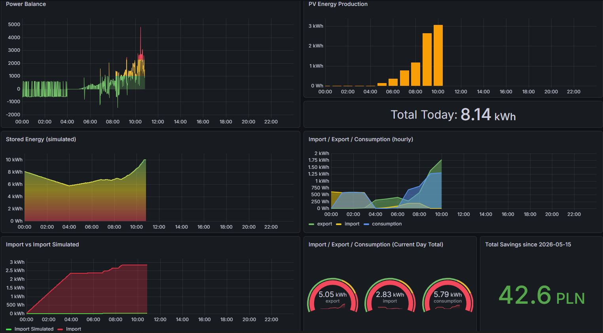
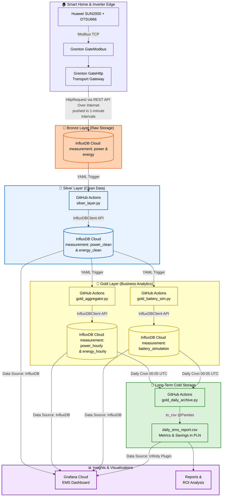

# iot-ems-data-pipeline

End-to-end time-series data pipeline for IoT-based energy management: data ingestion, cleaning, aggregation, and analytics using InfluxDB, Grafana, and Python.

<!-- DŁUGI OPIS -->

The primary business objective of this project was to build a **Digital Twin** simulating a 10kWh Energy Storage System (ESS) to calculate financial ROI, long-term energy self-sufficiency, and investment payback period under the G11 tariff framework in Poland.

## 🏗️ Core Architecture & Data Lineage

This project demonstrates a multi-layered data engineering pipeline applied to IoT streaming and batch-processed energy data. The architecture follows the **Medallion Architecture pattern (Bronze → Silver → Gold)**, enabling a clear separation between raw data ingestion, ETL processing, and Feature Engineering required for business insights.

## 🛠️ Detailed Pipeline Stage Breakdown

### 🥉 1. Bronze Layer (Edge Ingestion & Transport)

- **Data Source & Polling:** Grenton GateModbus controller polls registers from the Huawei SUN2000 Inverter and DTSU666 Bidirectional Smart Meter via **Modbus TCP** every 60 seconds.
- **Edge Processing:** Raw telemetry is mapped to Grenton user features (variables).
- **Transport Gateway** Grenton GateHttp module dynamically handles authentication tokens, configures HTTP headers, formats payloads using InfluxDB Line Protocol, and and securely dispatches time-series data via **HTTP POST requests** directly to the InfluxDB Cloud REST API over the Internet.
- **Data Integrity Principle:** No business logic, aggregation, or feature engineering is performed at the edge layer to preserve full traceability of raw data, following the principle: **"Raw Data is Immutable"**

### 🥈 2. Silver Layer (ETL Processing)

Automated Python ETL pipelines (`silver_layer.py`) are orchestrated using **GitHub Actions YAML workflows** to perform incremental cleaning, validation, and transformation of raw telemetry data.

- **Incremental Loading**: Minimizes API compute costs by tracking the last successfully processed timestamp and fetches only newly ingested, unprocessed data. This approach also mitigates issues caused by irregular and non-deterministic GitHub Actions execution intervals.
- **Domain-Aware Filtering**: Telemetry values are validated against hardware-specific operational boundaries derived from device specifications (e.g. Inverter production: `0 .. 10kW`, Smart Meter power balance: `-10 .. +10kW`). Corrupted samples or outliers (out-of-bound sensor glitches) are replaced using a combination of **linear interpolation** and forward-fill logic.
- **Virtual Metering**: The pipeline derives the building's absolute power consumption using a domain formula applied to clean metrics:  
  $$\text{Consumption} = \text{Production} + \text{Import} - \text{Export}$$
- **Monotonicity Enforcement**: Additional validation prevents negative data spikes in cumulative energy measurements caused by inverter reboots, communication failures, or hardware resets.

### 🥇 3. Gold Layer (Business Insights & Feature Engineering)

This layer is decoupled into two specialized micro-services:

A. `gold_aggregator.py`:
Resamples high-resolution telemetry into **clock-aligned 1-hour intervals**, creating clean data structures optimized for visualizations and Bussiness Inteligence workloads.

B. `gold_battery_sim.py` - **Digital Twin Engine**: implements a Digital Twin simulation of a virtual 10 kWh Energy Storage System (ESS).

Based on measured energy flows, the engine computes simulated energy behavior as if a physical battery system were installed.
The simulation dynamically modifies grid interaction metrics according to the virtual battery state:

- export_simulated is reduced while surplus PV energy charges the battery (stored_energy increases)
- import_simulated is reduced while the battery discharges to support local consumption (stored_energy decreases)
- core to the primary bussiness objective, the engine calculates simulated daily financial savings generated by the virtual Energy Storage System (ESS) model:  
  $$\text{Daily Savings} = (\text{Import} - \text{Simulated Import}) * \text{Rate per kWh}$$

The engine retrieves previous application state (stored energy and cumulative simulated counters) from InfluxDB before starting each stateful iteration cycle, to **eliminate the "Cold Start" state loss problem** inherent to stateless GitHub Actions runners.

### 🗄️ 4. Long-Term Data Archive (Cold Storage)

`gold_daily_archive.py` is executed as a separate YAML workflow - scheduled cron job runs daily at **00:05 UTC** to save aggegated energy values from the previous day (as well as daily savings calculated by the ESS Digital Twin simulation) into a single summary record and appends it to a flat Git-tracked archive file: `data/daily_ems_report.csv`. The workflow then performs fully automated Git commit and push operations, creating a lightweight long-term cold-storage mechanism with cloud-based data and built-in versioning.

### 📊 5. Analytics - Grafana Cloud EMS Dashboard

To provide intuitive operational insights, the system integrates a cloud-hosted EMS dashboard built on Grafana Cloud.

Energy and power-balance telemetry is retrieved from InfluxDB using the native **influxdb** data source plugin, while long-term financial and historical analytics are loaded directly from the Git-tracked CSV archive using the **Infinity** plugin.

The dashboard combines:

- real-time power telemetry
- energy flow analytics
- ESS Digital Twin simulation metrics
- cumulative financial savings projections

To enforce GitOps principles and ensure full infrastructure reproducibility (**Dashboard as Code**), the complete dashboard configuration is version-controlled and stored as a JSON definition within the `/src` directory of the repository.

A publicly accessible live dashboard is available here:

👉 **[Grafana Cloud EMS Dashboard](https://stanzolnierczyk.grafana.net/public-dashboards/8944e607f33d4e4a9fdd7d765f767c40)**

<!-- zamiast tego widoku dashboardu dodać pojedyńcze wykresy z wyjaśnieniami -->

  

<!-- DOTĄD przeczytane i poprawione opisy
 -->

---

<!-- na końcu jeszcze wyzwania i to co można by zrobić lepiej:
(wytłumaczenie, że ten pipeline działa, ale jest 'cost-optimized' i gdyby miał być wdrożony na produkcję to trzeba by dokonać kilku 'improvements')
- poprawa jakości danych PowerBalance - średnia krocząca z ostatnich 10minut, filtrowanie 'pików'
- retry logic dla POST request. Idealnie zastąpić MQTT który śledzi dostarczenie
- wykonywanie skryptów Pythona na dedykowanej wirtualnej maszynie (nie Github actions), co zapewnia większą stabilność i przewidywalność wykonania
- Cold Storage jako profesjonalny Data Lake w chmurze

 -->

## 🚀 Production Scaling, Challenges & Future Improvements

While this data pipeline is fully functional and architecture-complete, it is intentionally scaled down and **cost-optimized for individual deployment**. To elevate this system into a mission-critical, enterprise-grade production environment, the following structural enhancements should be implemented:

### 1. Edge Ingestion & Transport Resilience (MQTT Migration)

- **Current State:** The Grenton HTTP POST mechanism operates on a synchronous, request-response basis, exposing the edge gateway to localized data loss if internet connectivity or the cloud API drops out.
- **Production Improvement:** Integrate a retry logic with an exponential backoff directly at the edge layer. Ideally, migrate from REST HTTP to an asynchronous **MQTT protocol with QoS 1/2** managed by an edge broker (e.g., Eclipse Mosquitto). This introduces a local buffer ensuring guaranteed message delivery during network outages.

### 2. Advanced Stream Analytics for Operational Telemetry

- **Current State:** The smart meter produces high-frequency, noisy data streams (`powerBalance`) where momentary load spikes directly skew instantaneous calculations.
- **Production Improvement:** Implement an analytical pre-processing layer using moving averages (e.g., a 10-minute rolling average) and outlier clamping directly before the Bronze layer storage. This will provide smoother trending indicators.

### 3. Production Orchestration & Compute Environment

- **Current State:** Python ETL pipelines run on ephemeral GitHub Actions runners triggered by basic cron schedulers. Execution latency and execution time depend heavily on GitHub infrastructure availability.
- **Production Improvement:** Migrate data compute tasks to dedicated cloud-native environments (e.g., AWS EC2, GCP Compute Engine, or a lightweight Kubernetes pod). For enterprise scaling, the cron configuration should be replaced by a proper data orchestrator like **Apache Airflow** or **Prefect**.

### 4. Enterprise-Grade Cloud Data Lake

- **Current State:** Cold storage is maintained in a simple, file-based repository CSV structure to operate completely within free-tier ecosystem limitations.
- **Production Improvement:** Replace the GitHub-hosted CSV with a cloud object store behaving as a proper **Data Lake / Delta Lake** (e.g., AWS S3 or Google Cloud Storage).
